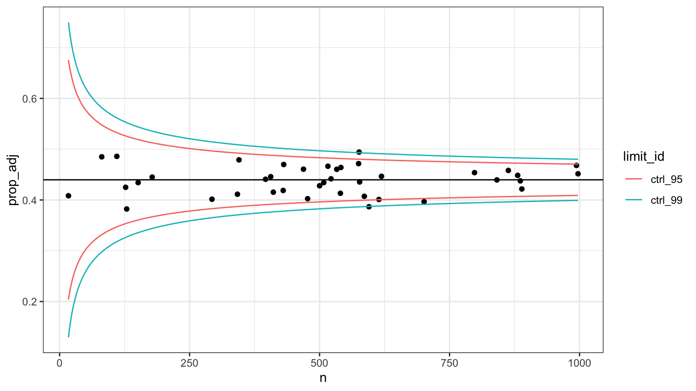
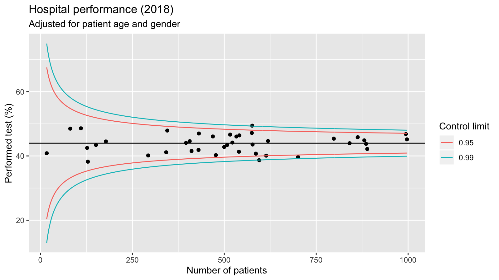

<!-- README.md is generated from README.Rmd. Please edit that file -->

# funnelplot

<!-- badges: start -->

[](https://travis-ci.org/oizin/funnelplot)
[](https://codecov.io/github/oizin/funnelplot)
<!-- badges: end -->

The goal of funnelplot is to simplify risk adjusted comparisons of
institutional (cluster) performance for the purpose of outlier
discovery.

## Installation

You can install the development version of funnelplot from
[GitHub](https://github.com/) with:

``` r
# install.packages("devtools")
devtools::install_github("oizin/funnelplot")
```

## Example

This is a basic example which shows you how to produce a risk adjusted
funnel plot with 95% and 99% control limits:

``` r
library(funnelplot)
data("example_data")

# outcome ~ covariates | cluster ID
f1 <- funnel(test ~ age + gender | hosp_id, pointTarget(limits = c(0.05,0.01)), data = example_data)
plot(f1) +
  theme_funnel()
```



funnelplot supports:

  - **Covariate risk adjustment**: control for differences in the
    characteristics of observations within each cluster. This is done
    through using a statistical model to estimate the expected outcome
    for each observation. This is followed by cluster level calculation
    of a suitable comparison measure of the observed and expected
    outcomes.  
  - **Multiplicity adjustment**: control for potentially high false
    positive rates in the comparison of large numbers of clusters.  
  - **Overdispersion**: In situations where there is large variation in
    performance between the clusters, and the outcome cannot be
    reliabilty predicted, one approach to avoiding labelling a large
    number of clusters as outliers is to adjust the control limits
    outward by an *inflation factor* (e.g. 20%). The *inflation factor*
    can be estimated using the data, with the ability to leave a certain
    percentage of the best and worst performing clusters left out of the
    calculation.

All objects returned by `funnelplot::plot()` are
[ggplot2](https://ggplot2.tidyverse.org/) objects enabling further
customisation:

``` r
library(ggplot2)
plot(f1) +
  labs(x = "Number of patients", y = "Performed test (%)", title = "Hospital performance (2018)", 
       subtitle = "Adjusted for patient age and gender") +
  scale_y_continuous(breaks = seq(0.2,0.6,0.2),labels = 100*seq(0.2,0.6,0.2)) +
  scale_color_discrete(name = "Control limit", labels = c(0.95,0.99)) +
  theme_grey()
```



See the vignettes:

``` r
# vignettes
vignette("funnelplot-intro")
```

## References

Benjamini, Y., & Hochberg, Y. (1995). Controlling the false discovery
rate: a practical and powerful approach to multiple testing. Journal of
the royal statistical society. Series B (Methodological), 289-300.

Jones, H. E., Ohlssen, D. I., & Spiegelhalter, D. J. (2008). Use of the
false discovery rate when comparing multiple health care providers.
Journal of clinical epidemiology, 61(3), 232-240.

Spiegelhalter, D. J. (2005). Funnel plots for comparing institutional
performance. Statistics in medicine, 24(8), 1185-1202.
